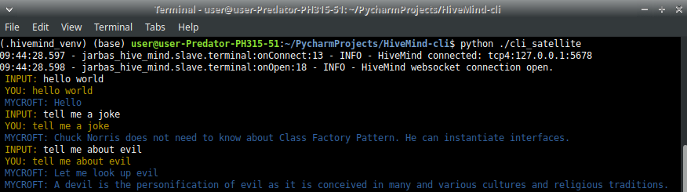

# HiveMind - Mycroft Text CLient



## Install

```bash
$ pip install HiveMind-cli
```
## Usage

```bash
$ HiveMind-cli --help

usage: HiveMind-cli [-h] [--access_key ACCESS_KEY] [--crypto_key CRYPTO_KEY] [--name NAME] [--host HOST] [--port PORT]

optional arguments:
  -h, --help            show this help message and exit
  --access_key ACCESS_KEY
                        access key
  --crypto_key CRYPTO_KEY
                        payload encryption key
  --name NAME           human readable device name
  --host HOST           HiveMind host
  --port PORT           HiveMind port number

```